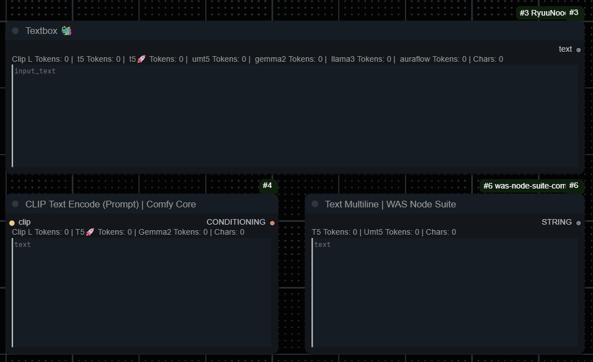
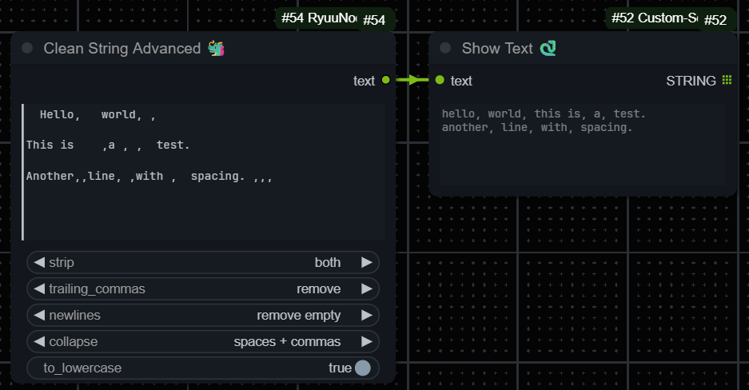

  

<h1 align="center">ComfyUI-RyuuNoodles 🐲</h1>

Collection of one or more custom nodes for ComfyUI made mainly for personal use ...rawr...

ComfyUI Registry: https://registry.comfy.org/nodes/RyuuNoodles

To see the settings this pack adds, please see [SETTINGS.md](SETTINGS.md).

## Features/Nodes

### Live Token Counter on Textboxes

  

Yeeeeeee.

No CLIP input required. With this repo/custom nodes you'll have the ability to add a token counter with variable tokenizers to any node/widget you desire (preferably a multiline text widget but you do you lol).
This is done by going to the "RyuuNoodles 🐲" settings page and adding the internal node name and the widget name of that node you want the counter to be on top of.

#### Format

`Node_Name.widget_name:Tokenizer1,Tok2,Tok3;Node Name 2.widget_name:Tok1;` etc...

- Supported tokenizers: `CLIP_L, T5, T5_FAST, UMT5, GEMMA2, LLAMA3, AURAFLOW`
- RegEx is _not_ supported; Spaces are allowed, they will be stripped anyway (node name is excluded from stripping too naughty)
- The tokenizer types will appear in the counter in the order you added them.

**To get the internal node name:**  
Right-click a node and select 'Properties Panel'. The value for `Node name for S&R` is what you want to copy.

**To get the widget name:**  
Usually it's simply the placeholder text (or input name on single line text widgets).  
(if there's a custom placeholder text... uh good luck, maybe need to read the code of that custom node in that case)

#### Example (also default value)

`Ryuu_TokenCountTextBox.input_text:CLIP_L,T5_FAST;CLIPTextEncode.text:CLIP_L,T5_FAST;`  
This adds the CLIP-L and T5🚀 (🚀= Fast) token counters ontop of the RyuuNoodles Textbox and the Comfy Core Clip Text Encode (Prompt) node.  
Also: The Text Multiline node from WAS node suite shown in the gif above has the node name `Text Multiline`

INFO, expand me uwu.. wait, I'm already expanded!

**Wildcards/Prompt Control or Scheduling etc:**  
Not supported. The counter reads what's inside the widget it's assigned to, the wildcard processor nodes only process the text when queued, same with prompt scheduling. It's possible to make a wildcard node that works, but it would have to work with an external seed/randomization thingy and whatnot, and it probably wouldnt help with reproducability/saving workflow and whatnot.  
[comfyui-ppm](https://github.com/pamparamm/ComfyUI-ppm) and [JNodes](https://github.com/JaredTherriault/ComfyUI-JNodes) (not KJNodes) offer a Token Counter that executes when queued.

**When you install this node pack**, it will do a one time download with huggingface transformers on first start after install of a few MBs of files (most are ~1 MB json files, more or less) for the supported tokenizers. (total is probably like less than 30mb maybe? dont take my word on it)

**Regarding the "fast" versions of the T5 tokenizer:**  
It's faster as far as I could tell, otherwise i don't know much about it. There is one for CLIP too but it was slower for me so i didnt include it

The workings

Too lazy to add detailed information here but the code to display it on the node is in `tokenCounterOverlay.js` using mainly `nodeType.prototype.onDrawForeground` and the code that turns text into tokens is in `update_token_count.py`

There is a minimal standalone version/script for CLIP-L here:  
<https://gist.github.com/DraconicDragon/10ac26d0d11ea9b14a0edae5d728bc96>

### Switches with Fallback

Yes, there are already quite a few switch custom nodes. However I couldn't find any that would accept an/the second input being empty/None due to the connected node being bypassed or muted so I made these.  
The Switch Any Fallback node is probably the best choice here  
although there's also an "Image" and "Latent" specific variant if you like the colors it gives the noodles i guess.

(True = input 1 will be chosen; False = input 2 will be attempted to be chosen, if fail due to input being None, output will use input 1 data and a message will be printed to console)

Some random note

I briefly had the idea of allowing the user to add more switch nodes through a yaml with multiple inputs but I think this isn't good for reproducability/sharing the workflow.

A solution to still have a similar kind of thing is making a switch node that would allow a dynamic amount of inputs that increases using an option on the node or increases by 1 as inputs are being populated, however ComfyUI frontend updates are moving fast any changing how inputs work, and it seems like it breaks things like this (as can be seen on the Impact Pack Switch (Any) node as of writing, it doesn't create new inputs anymore) so I'm holding off working on that

#### Passthrough node

Has the same functionality as the switch nodes, just without the boolean switch.

### Strings/Text

Makes text nice and clean.

Settings

`strip`:

- Options: `off`, `left`, `right`, `both`  
- Description: Control which side(s) of whitespace to strip from the input string.

`trailing_commas`:

- Options: `off`, `remove`, `add`, `add + space`  
- Description: Remove or add a comma at the end of the input string. Will not add a comma if one already exists, but will add a space if `add + space` is chosen and a comma exists but no space.

`newlines`:

- Options: `off`, `remove empty`, `collapse lines`  
- Description: Control how newlines are handled:  
  - `off` = keep all lines  
  - `remove empty` = drop blank lines  
  - `collapse lines` = join all lines into one

`collapse`:

- Options: `off`, `spaces`, `spaces + commas`  
- Description: Replace multiple subsequently appearing spaces or in combination with commas in the input string with a single occurrence of what's being removed.

`to_lowercase`:

- Options: `true`, `false`  
- Description: Convert all characters in the string to lowercase.

### Numbers/Sliders

(ignore that int slider says output is FLOAT, and the non 0.005 stepping, its fixed but too lazy to update gif)

Edit: I added another Float node at some point with higher limits called 'Float L 🐲' meant for use as CFG in rather mainstream ranges

Yeah I really just wanted these and yeah, those limits are real (and not configurable as of now and probably won't be):  
Float and Float Slider only do 0.0 to 1.0 with the second one having a stepping of 0.005  
Int Slider has a limit of 0–50 with a stepping of 1.

The float nodes round with three decimal places to keep the funny rounding "error" thingy away.

- Float Slider and Float are meant for denoise  
- Float L is meant for CFG  
- Int Slider is meant for steps

Use [ComfyUI_NYJY](https://github.com/aidenli/ComfyUI_NYJY) for a float slider but with actual configurable options, i believe [mixlab](https://github.com/shadowcz007/comfyui-mixlab-nodes) also has one.

### Todo (maybe)

- [ ] make a wildcard node that works like impact pack's (possibly by using impact pack's class, would only work while the pack is installed) but have wildcard be resolved during typing and not on queuing the workflow; need to look into how to preserve the seed and output string for reproducabilty, might not be possible

- [ ] not really a todo but the token counter pushes up the input/output dot names by a few pixels which is probably caused by the extra 2 i added on pushing the counter display up to not collide with the textbox outline while selected/typing