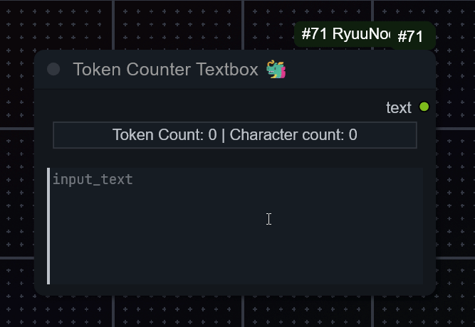
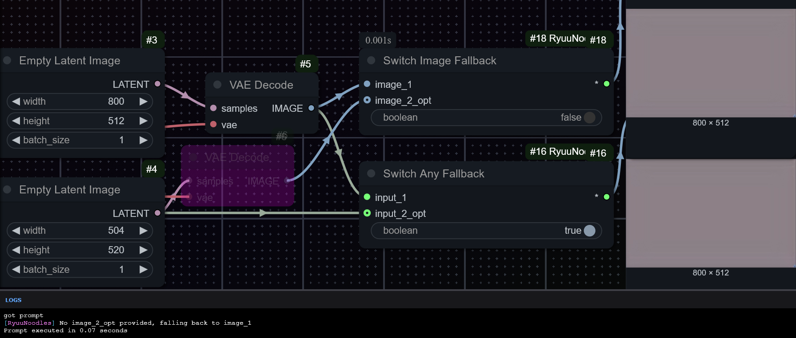
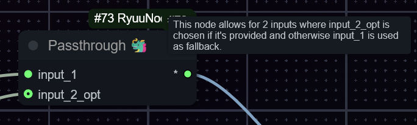
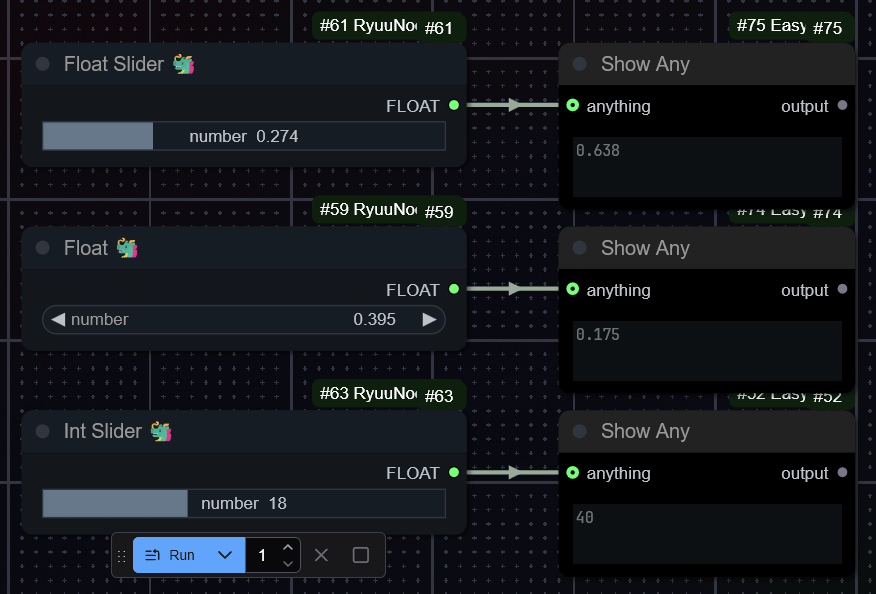

# ComfyUI-RyuuNoodles 🐲

Collection of one or more custom nodes for ComfyUI made mainly for personal use ...rawr...

## Live Token Counter / Character Counter Textbox

This was easier to add than I thought although I still want to figure out how to make it an actual label kind of thing instead of using a button as substitute, but its working fine. Update rate is once per second for now defined in the JS. maybe its possible to make it so it hijacks other nodes

The workings
It just downloads the json files and merge.txt (not the actual model) from openai/clip-vit-large-patch14 using hf transformers and tokenizes the text then, as i said: very simple

There is a standalone version here: https://gist.github.com/DraconicDragon/10ac26d0d11ea9b14a0edae5d728bc96

## Switches with Fallback

Yes, there are already quite a few switch custom nodes. However I couldn't find any that would accept an/the second input being empty/None due to the connected node being bypassed or muted so I made these.
The Switch Any Fallback node is probably the best choice here although there's also an "Image" and "Latent" specific variant if you like the colors it gives the noodles i guess.

(True = input 1 will be chosen; False = input 2 will be attempted to be chosen, if fail due to input being None, output will use input 1 data and a message will be printed to console)

Some random note
I briefly had the idea of allowing the user to add more switch nodes through a yaml with multiple inputs but I think this isn't good for reproducability/sharing the workflow.

A solution to still have a similar kind of thing is making a switch node that would allow a dynamic amount of inputs that increases using an option on the node or increases by 1 as inputs are being populated, however ComfyUI frontend updates are moving fast any changing how inputs work, and it seems like it breaks things like this (as can be seen on the Impact Pack Switch (Any) node as of writing, it doesn't create new inputs anymore) so I'm holding off working on that

### Passthrough node

Has the same functionality as the switch nodes, just without the boolean switch.

## Numbers/Sliders

(ignore that int slider says output is FLOAT, its fixed but too lazy to update gif)
Yeah I really just wanted these and yeah, those limits are real (and not configurable as of now): float nodes only do 0.0 to 1.0 with the second one having a stepping of 0.005 and the Int Slider has a limit of 0-50 with a stepping of 1.
Both of the float nodes round with three decimal places to keep the funny rounding "error" thingy away.
